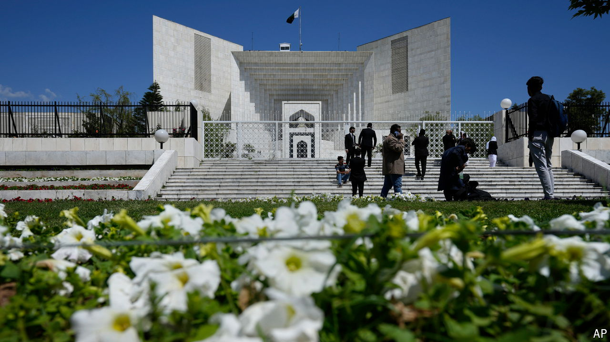

###### Cut down to size

# Pakistan’s politicians seize control of the judiciary 

##### Powerful judges were seen as a threat to the government 

 

> Oct 31st 2024 

Voting in Pakistan’s lower house of parliament began at 3.30am on October 21st. A two-thirds majority to amend the constitution was secured at 5am. At 6.30am a bleary-eyed Asif Ali Zardari, the president, signed into law the 26th amendment to the constitution. In a race against time, Pakistan’s parliament had won. The rules governing the judiciary had been radically altered, days before the election of the next head of the Supreme Court.

