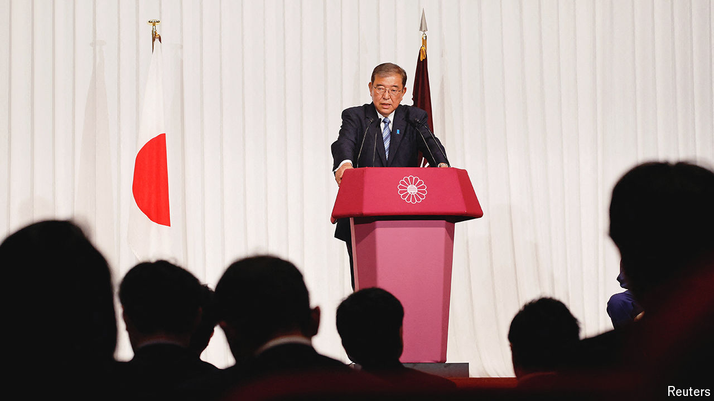

###### Japan shakes

# Voters deliver a historic rebuke to Japan’s ruling coalition 

##### But the Liberal Democratic Party may still hang on to power 

 

> Oct 28th 2024 

JAPAN’S RULING coalition failed in lower-house elections on October 27th to secure a majority in parliament for the first time since 2009. This stunning rebuke of the long-dominant Liberal Democratic Party (LDP) reflects voters’ frustrations over recent political scandals and the rising cost of living. The results are a “severe judgment” of the LDP, said Ishiba Shigeru, who  this month. “We must reflect from the bottom of our hearts and transform.” 

