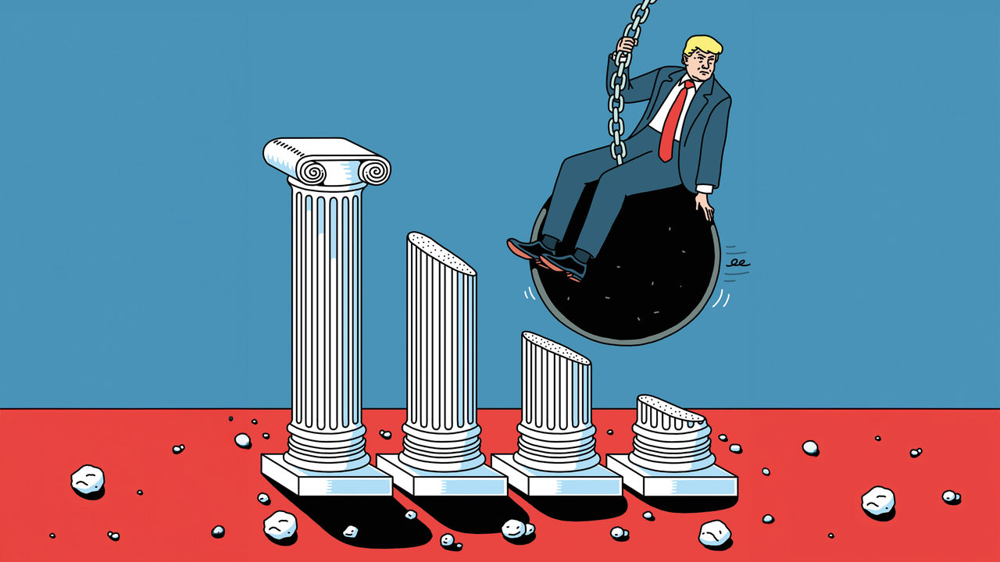

###### A sting in the tail risks

# How bad could a second Trump presidency get? 

##### The damage to America’s economy, institutions and the world would be huge 

 

> Oct 31st 2024 

On the Stump, Donald Trump makes lots of eye-widening pledges. He will deport illegal immigrants by their millions; he will launch missiles at Mexico’s drug cartels; he will use the army to crack down on the “far-left lunatics” who run the Democratic Party. Yet Mr Trump’s tenure as president, whatever its merits or failings, was not the cataclysm that many Democrats had predicted. The economy hummed along, until the pandemic struck. There were no big foreign-policy crises. And although Mr Trump tried to steal the presidential election of 2020, he failed.

