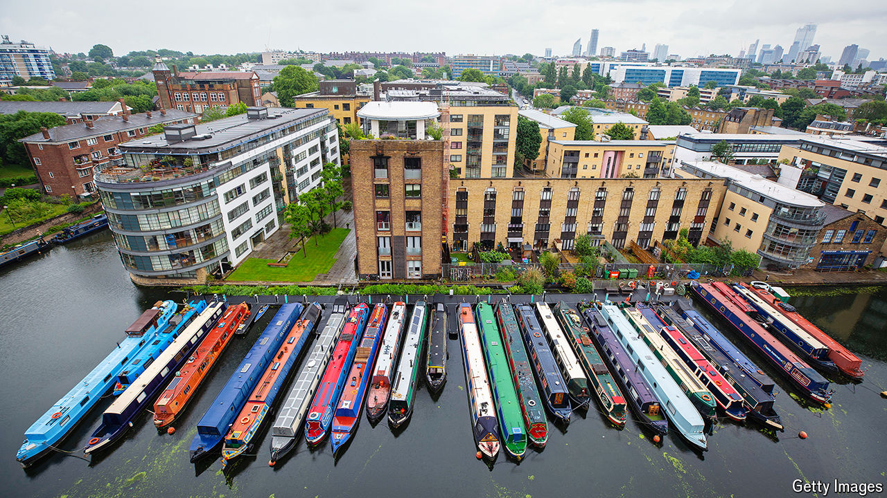

###### Life on the water

# A growing number of Britons live on canal boats 

##### But the costs are rising 

 

> Oct 31st 2024 

ZOE BULSARA has swans for neighbours. Her mornings sometimes start with ethereal sunrises over long stretches of water. Four months ago the 24-year-old illustrator left her home in Bristol and bought a narrowboat, reckoning that it would cost less than renting a property. Since then she has been cruising around Britain’s canals. There is a freedom, she says, in not being anchored to one place.

