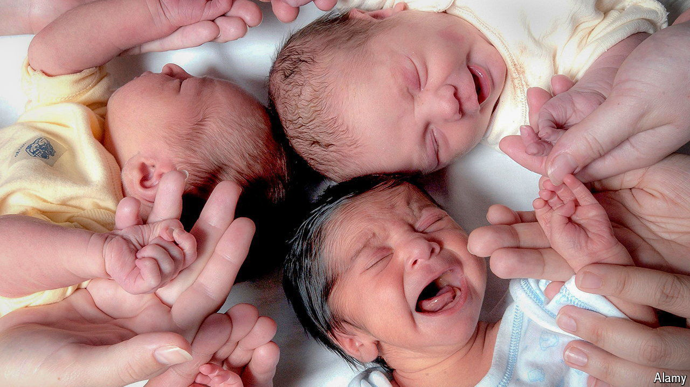

###### Demography

# Britain’s birth rate has crashed. It is likely to recover 

##### Immigrants to the rescue, again 

 

> Oct 29th 2024 

Across london, primary schools are under threat. In Tulse Hill, in the south of the capital, parents and local politicians are trying to save Fenstanton Primary School, pleading that it is “the beating heart” of a poor neighbourhood. Lambeth Council is likely to shut it anyway, citing a sharp decline in the number of young children in the area. The school could hold 630 pupils. It had just 271 in January. 

