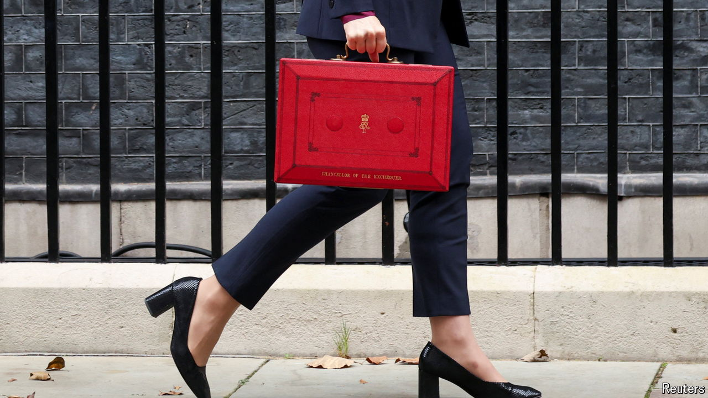

###### The tax lever

# Britain’s budget is heavy on spending but light on reform 

##### Rachel Reeves has raised both borrowing and taxes by historic amounts 

 

> Oct 30th 2024 

No one could argue the numbers in  were too small. On October 30th Rachel Reeves, the chancellor, laid out over £40bn ($52bn) in tax rises, more than any budget has raised in at least half a century. Borrowing went up, too. Ms Reeves loosened the rules constraining borrowing to invest, and then ran close to the limit of her newly generous yardstick. 

