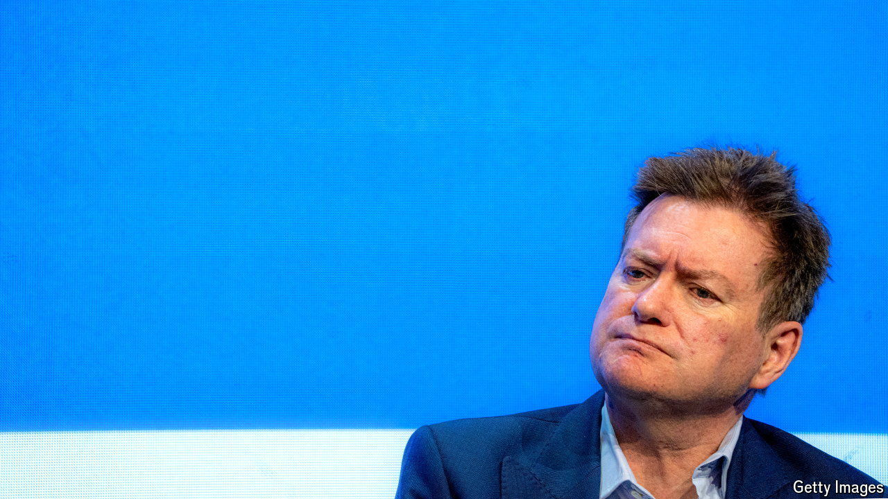

###### Money, the media and power

# Meet one of Britain’s most influential, least understood people 

##### What drives Sir Paul Marshall, financier, philanthropist and rising media mogul? 

 

> Oct 28th 2024 

Smashed avocado is not on the breakfast menu at the Old Queen Street Cafe, a stone’s throw from Parliament. Instead the home-sourced offerings include Welsh rarebit, black pudding and, for lunch, smoked-eel fish fingers with pickled onion. The decor—“100% my taste”, says Sir Paul Marshall, the owner—is as patriotic as the food. Photos depict classic British scenes: swimmers in the Thames, a brass band. The floorboards, salvaged from the War Office, were trod by .

