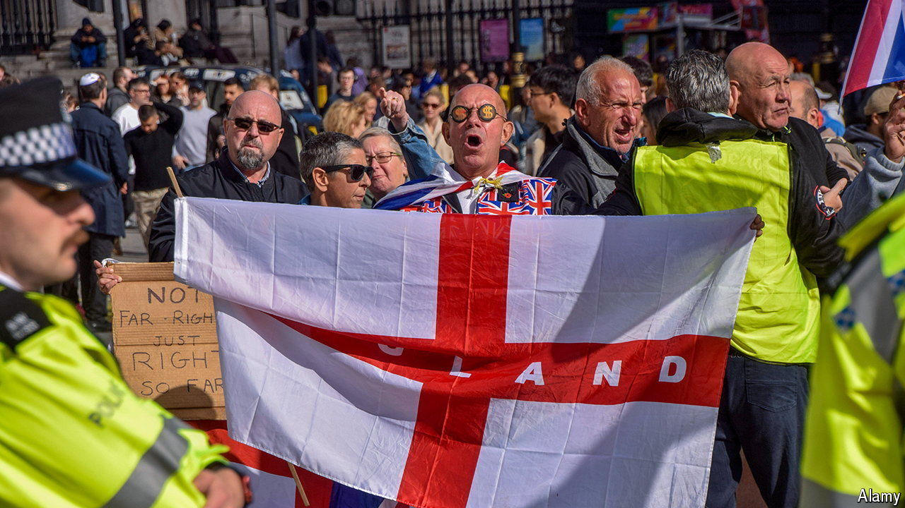

###### Grievance politics

# The extreme right after the riots in Britain 

##### An amorphous movement marches in London 

 

> Oct 27th 2024 

In the end the protest was, a bit like the weather, a damp squib. On October 26th the first major rally organised by the extreme right since  in late July and early August took place in central London. Perhaps a few thousand protesters turned up, fewer than the number who attended a similar rally in July. But the riots and their aftermath have been added to the list of grievances nursed by demonstrators. 

