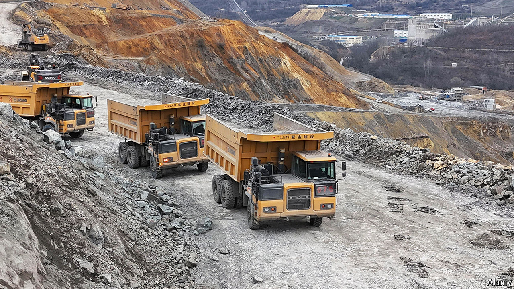

###### Dig, baby, dig

# China is tightening its grip on the world’s minerals 

##### That is making Western policymakers anxious 

 

> Oct 31st 2024 

To decarbonise the global economy and build the data centres needed for ever smarter artificial-intelligence models, the world will need lots of minerals. China wants first dibs. Last year its companies ploughed roughly $16bn into mines overseas, not including minority investments.

