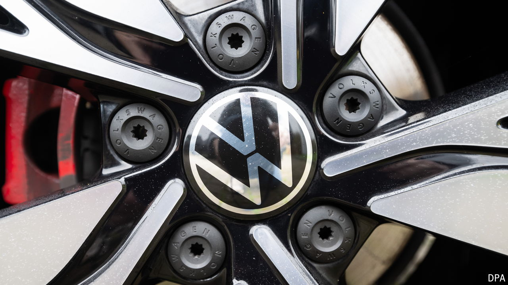

###### From shuddering to shuttering

# Volkswagen’s woes illustrate Germany’s creeping deindustrialisation 

##### And intensify the problems of Olaf Scholz’s fractious coalition 

 

> Oct 31st 2024 

The spectre of deindustrialisation has long haunted Germany. Russia’s full-scale invasion of Ukraine in 2022 caused energy prices to spiral. The economy of Germany’s biggest trading partner, China, has slowed. And as competitors, Chinese carmakers are proving more than a handful for Europe’s biggest, Volkswagen (VW). Now the apparition looks worryingly solid. “The signs of deindustrialisation are becoming clearer,” warned Martin Wansleben, head of the German chamber of trade and industry (DIHK), on October 29th. 

