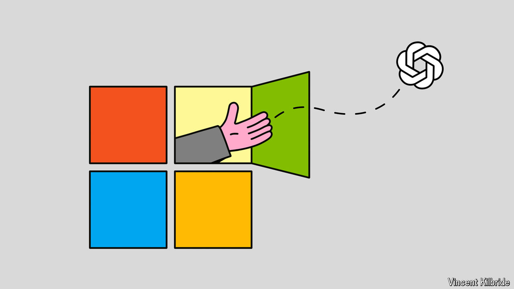

###### The Medicis and Michelangelo

# What if Microsoft let OpenAI go free? 

##### It may not be as crazy as it sounds 

 

> Oct 28th 2024 

Call it a spectacular modern-day version of Renaissance patronage. Since 2019  has provided more than $13bn in cash and computing capacity to , a once-penniless startup that is now at the forefront of generative artificial intelligence (AI) and, as of its most recent fundraising round, worth $157bn. In exchange, Microsoft has gained the exclusive right to run OpenAI’s models on Azure, its .

