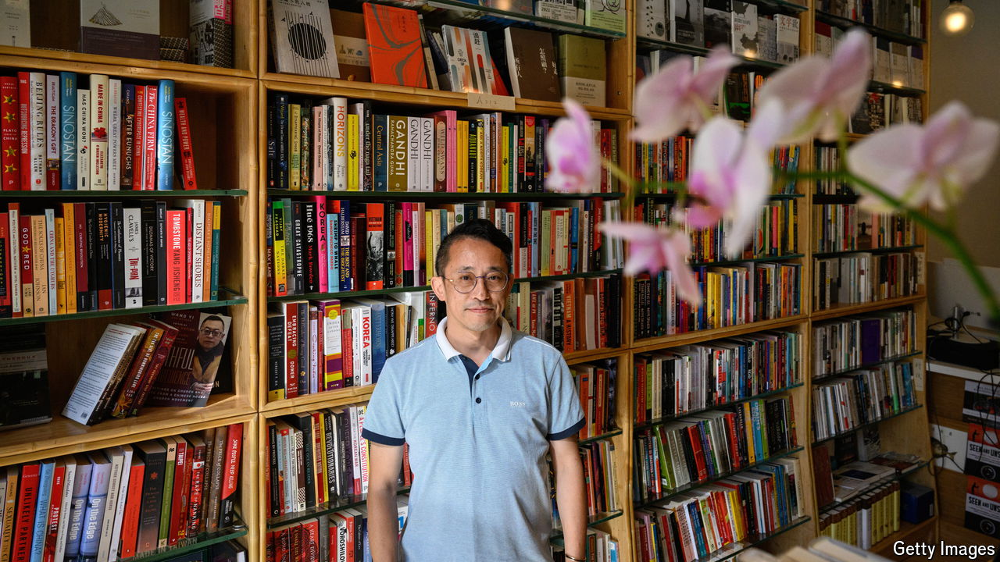

###### Readers in exile

# A new intellectual hub for Chinese émigrés in Washington 

##### With little space for free expression in Xi Jinping’s China, liberals are opening forums abroad 

 

> Oct 31st 2024 

The bookstore in the metro station beneath Shanghai’s city library seemed increasingly out of place in Xi Jinping’s China. Founded in 1997 by Yan Bofei, who researched philosophy, Jifeng Books was known for holding lectures on topics such as democracy and labour rights. Its selection of works on the humanities and social sciences was far from the Communist Party’s recommended fare. The shop was purchased in 2012 by Yu Miao, who hoped to maintain it as a liberal forum. But in 2018 the government refused to renew its lease. Officials made clear that they did not like the ideas that Jifeng was spreading. 

