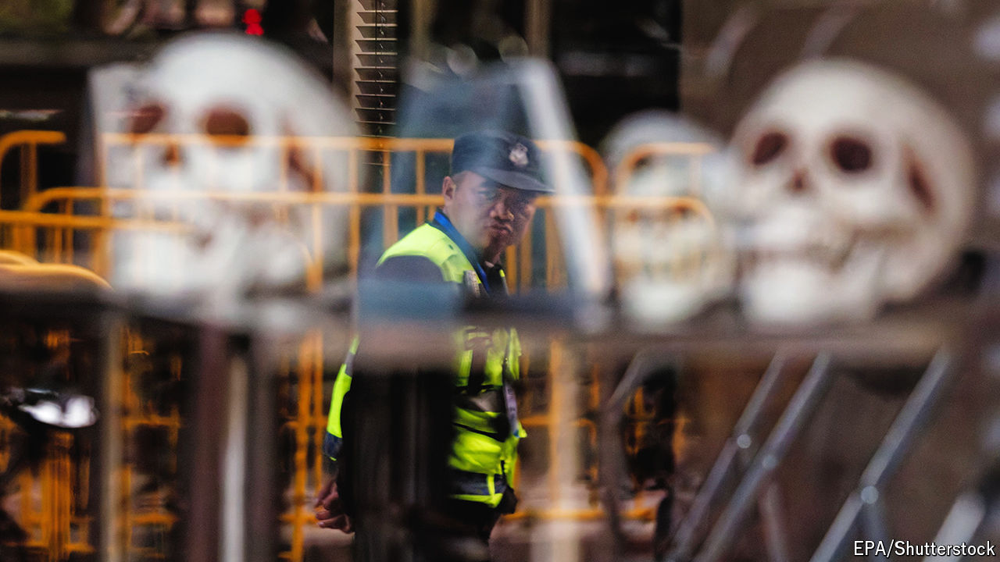

###### Frightened by Halloween

# China rounds up Batman, Donald Trump and the Buddha 

##### Young people in fancy dress are spooking the Chinese government 

 

> Oct 31st 2024 

HALLOWEEN IS A time of scares—not least for the Communist Party. With few opportunities to express their frustrations with the government, Chinese revellers have been known to speak through their costumes. Last Halloween, the first since pandemic controls were lifted, young adults in Shanghai dressed up as surveillance cameras and covid-19 testers. One brave soul emerged as Winnie-the-Pooh, a podgy cartoon bear whom China’s ruler, Xi Jinping, supposedly resembles. The government . And it is increasingly clear that it detests Halloween.

