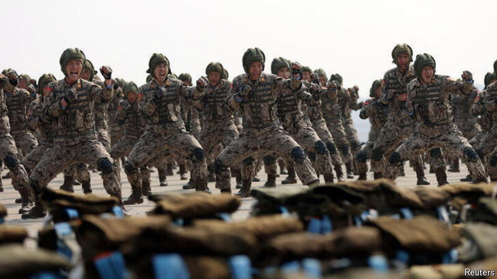

###### A discomforting deployment

# North Korea’s aid to Russia raises difficult questions in China 

##### Officials in Beijing fear they are losing leverage over their neighbours 

 

> Oct 31st 2024 

Officials FROM China have avoided direct comment on North Korea’s despatch of thousands of troops to Russia, where they might help in a conflict that all three countries see as a contest against overweening American might. China itself is a crucial if undeclared backer of Russia’s war effort in Ukraine, providing technological support for Russia’s defence industries. But behind closed doors, Chinese officials may question North Korea’s move.

