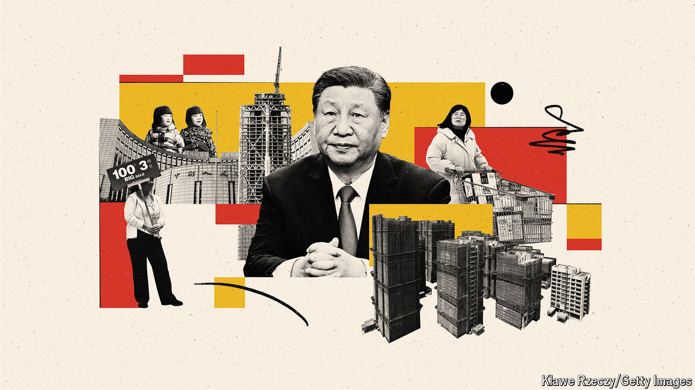

###### An insurance policy against MAGA

# Why China may be saving its bazooka for Donald Trump 

##### The Communist Party may be hoarding fiscal firepower to offset a possible trade war 

 

> Oct 29th 2024 

OF ALL THE people anxiously watching America’s presidential election, spare a thought for Chinese investors. Their economy is already contending with a property slump that began more than three years ago and persistent deflation that began over 18 months ago. Now they must contemplate a  to the White House, bringing the threat of steep tariffs in his wake.

