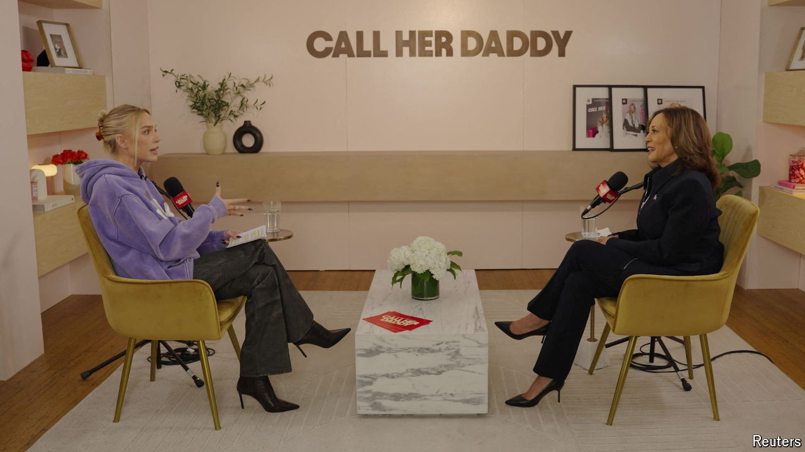

###### Electioneering

# How podcasts came to rule America’s campaign conversation 

##### Cosy chats have replaced hard-hitting interviews 

 

> Oct 31st 2024 

DONALD TRUMP likes to talk. That much was clear from his three-hour interview on “The  Experience”, America’s most popular podcast, on October 25th. He rambled about “The Apprentice”,  and aliens. It was not your usual presidential patter.

