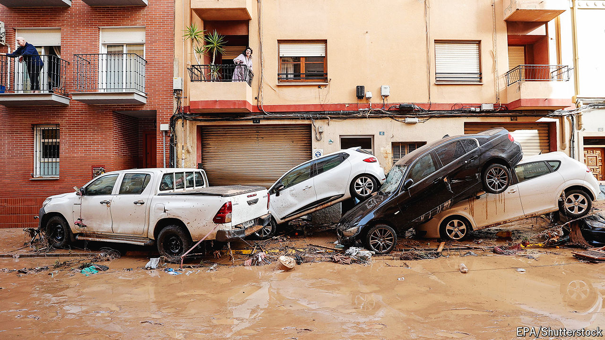

###### Spanish floods

# Floods in Spain cause death and devastation 

##### The storms resulting from the seasonal “cold drop” are strengthened by global warming 

 

> Oct 31st 2024 

Flash flooding ravaged parts of southern Spain, killing at least 95 people, as the equivalent of months of rainfall fell within a matter of hours. The area around Valencia was the worst affected, accounting for at least 92 deaths. There have been widespread accusations that the country’s disaster-relief authorities were too slow to issue warnings that might have enabled people to get off roads or seek higher ground. Spain’s prime minister, Pedro Sánchez, declared three days of national mourning. The extreme downpour is being blamed on a seasonal  or “cold drop”, when cold air meets warmer air from the Mediterranean and leads to storms. But global warming has caused the clouds to carry more moisture. ■

