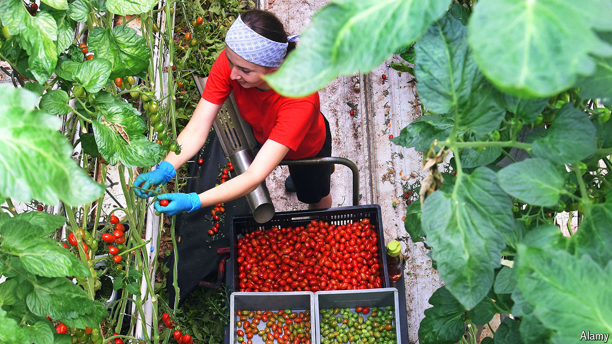

###### Free roaming

# The immigrants Europe quietly wants more of 

##### Without foreign farm workers the EU’s berries would go unplucked 

 

> Oct 31st 2024 

LOOK OUT of a train window in Dutch farm country, and much of what you see is glass: row after row of greenhouses. At René Simons’s farm 60km south-east of Rotterdam, the raspberry bushes ramble across acres of trellises. The workers who pick them are mostly from eastern Europe—Poles and Bulgarians in peak season or Ukrainians, who often stay longer. “We have a few ladies from near Lviv now,” says Mr Simons. “We tell them, if it gets tough there, you can always stay here.”

