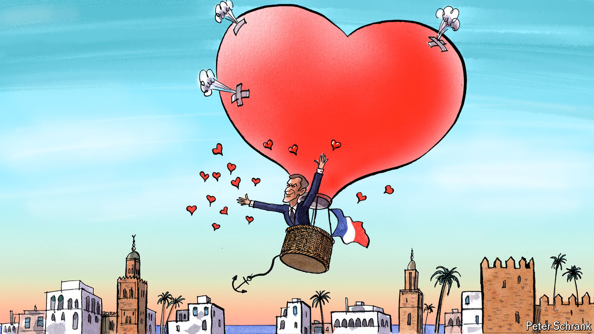

###### Charlemagne

# The power and limits of Emmanuel Macron’s diplomatic charm 

##### French affairs of heart and state 

 

> Oct 31st 2024 

When the insipid joint declarations of day-to-day diplomacy have long since been consigned to dusty shelves, it is photos and videos of the hugs and handshakes, the pomp and marching bands that endure. So it will doubtless be after this week, when the French president, Emmanuel Macron, took three days off from  to enjoy a state visit to Morocco, hosted by its king, Mohammed VI. Greeted by a 21-gun salute, Mr Macron rode alongside the monarch in an open-top car past applauding crowds. The French president returned the compliment, confirming his country’s fresh support for Morocco’s claim to sovereignty over Western Sahara, a contested slice of land, and proclaiming a reinforced partnership “of exception” between the two countries.

