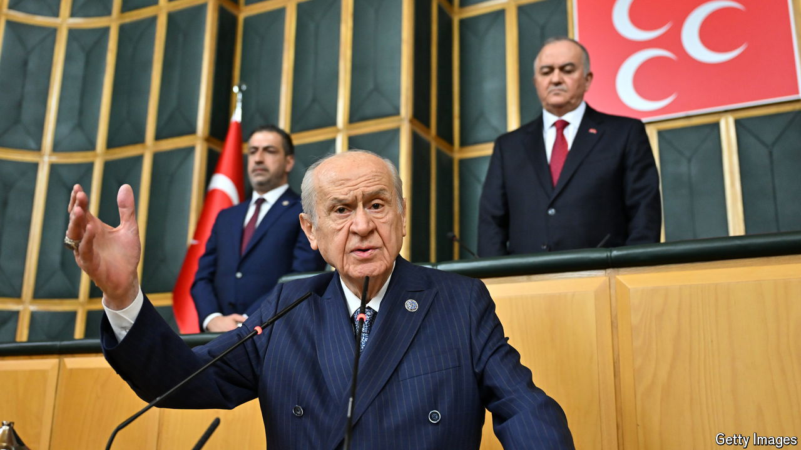

###### The long road to peace

# Turkey could soon strike a historic peace deal with the Kurds 

##### But many pitfalls lie ahead 

 

> Oct 31st 2024 

DEVLET BAHCELI, the leader of Turkey’s biggest nationalist party, has made a career out of opposing concessions to the country’s 15m-strong Kurdish minority. The only solution to Turkey’s conflict with armed Kurdish separatists, he has long argued, is to pound them into the ground. Since 2016, when Mr Bahceli and his Nationalist Movement Party (MHP) threw their weight behind Turkey’s president, Recep Tayyip Erdogan, he has been able to put his convictions to work. On his watch, the government unleashed armed offensives against the outlawed Kurdistan Workers’ Party (PKK) at home and abroad. Thousands of Kurdish politicians and activists ended up behind bars. 

