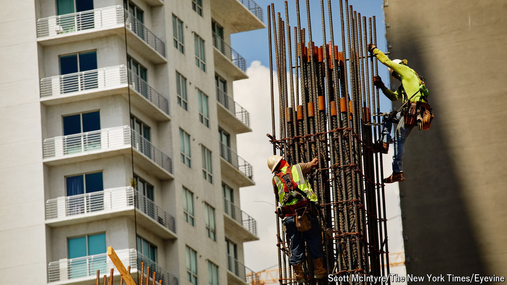

###### Death of despair

# American men are getting back to work 

##### The ultra-gloomy picture painted by politicians is no longer accurate 

 

> Oct 31st 2024 

America’s politicians have long worried about the rising share of men out of work. More on the sidelines means slower economic growth, heftier benefit payments and a frailer social fabric. During the election campaign, both candidates have offered policies designed to tackle this long-standing problem. Donald Trump proposes sweeping tariffs and clamping down on illegal immigration. Kamala Harris vows to revive traditional male sectors, not least manufacturing. 

