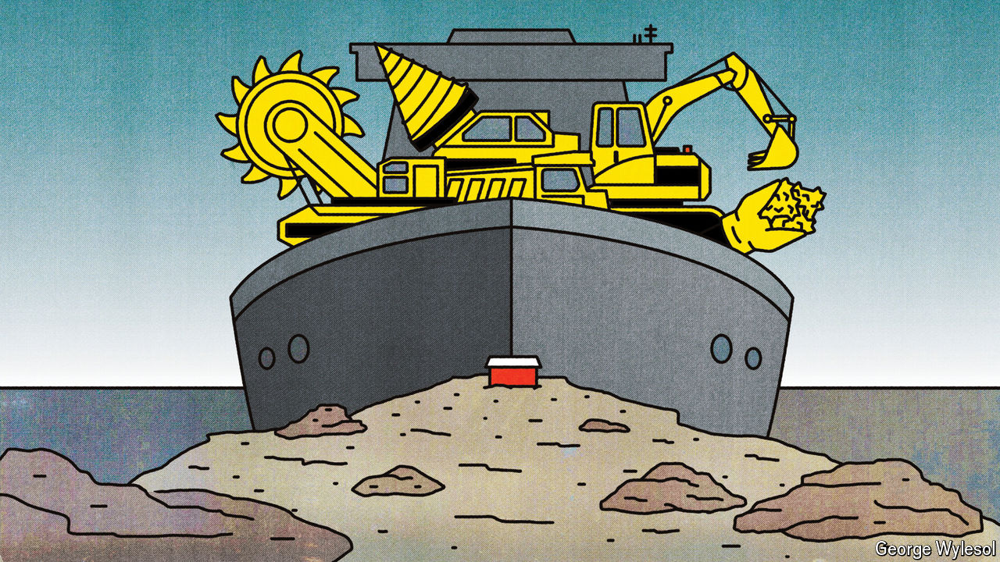

###### Free exchange

# Greenland faces one of history’s great resource rushes—and curses 

##### The territory sits on an astounding number of critical minerals 

 

> Oct 31st 2024 

A billion years ago, as one tectonic plate ripped apart from another, two chambers of magma were sealed off beneath what would later become Greenland. As thousands of years passed, the magma cooled, each layer crystallising under rarefied conditions. Today the Ilimaussaq intrusion is a giant fold of rock beneath Gardar, in south-west Greenland. By a stroke of luck, it is home to 30 of the world’s most desired raw materials. 

