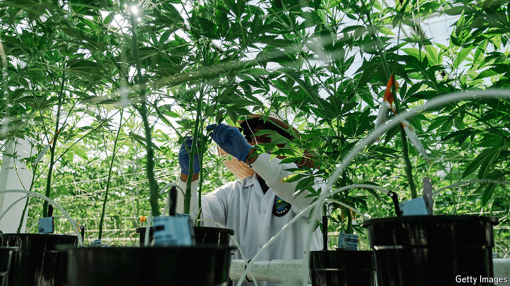

###### In search of lost revenue

# Sin taxes are suffering from a shortage of sinners 

##### Governments across the rich world are looking for alternatives 

 

> Oct 31st 2024 

Pity the California taxman. The state has a yawning budget deficit, which politicians are attempting to narrow. Local laws make it difficult to raise taxes, requiring a two-thirds majority. Worse, once-reliable sources of funds are running dry. Fuel-tax revenues are forecast to fall sharply as drivers switch to electric vehicles. Revenues from cigarette taxes have fallen by $500m, or 29%, since 2017; now those from alcohol taxes are dropping, too. This is a concern: at present, revenues from the trio of taxes amount to nearly half of what the state spends on higher education. 

