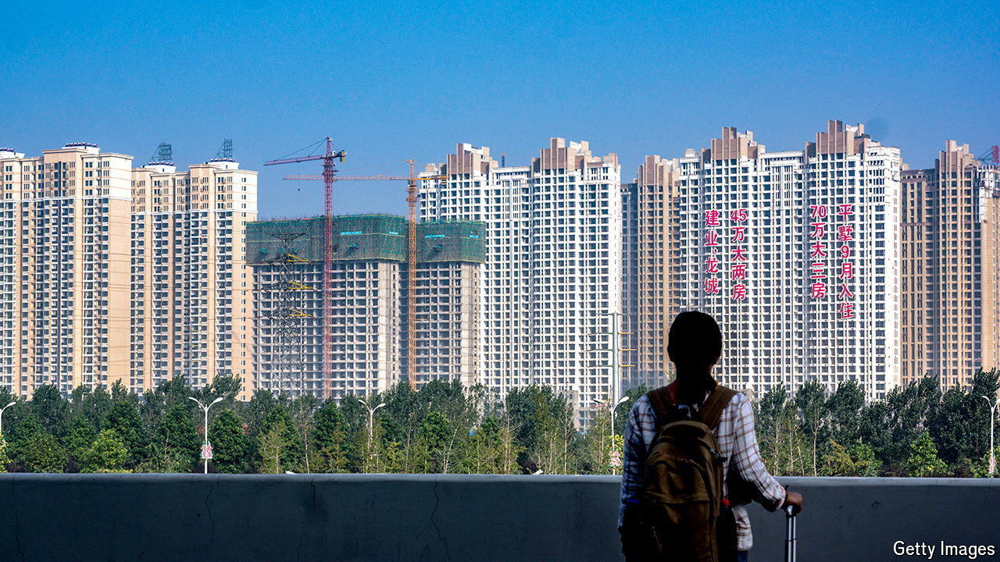

###### Economic rescue

# Why China needs to fill its empty homes 

##### The country’s economy is broken. A recovery requires a healthier property market 

 

> Oct 31st 2024 

If not another flat was built and sales continued at their current pace, it would take eight years to sell all the homes lying dormant around Luoyang, a city of 7m in central China. The region is a hot spot for the country’s property crisis, where years of overbuilding have turned entire districts into housing graveyards. Sprawling wastelands of concrete and glass scar the city.

