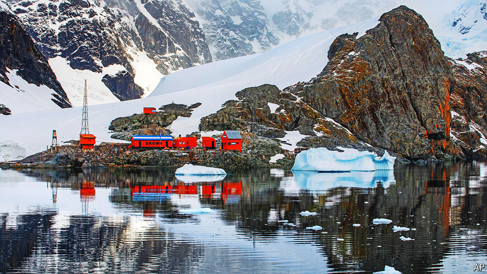

###### Diplomacy on ice

# Intrigue, greed and hostility burn in the Antarctic 

##### If you thought its freezing icescapes would escape a world on fire, think again 

 

> Oct 31st 2024 

IMAGINE A LAND untouched by war, unspoilt by humans, where all nationalities are welcome—a veritable Shangri-La. Such a place exists in Antarctica, the Earth’s southernmost region. Home to 40m penguins and a mere 1,000 people, the continent is owned by no one. 

