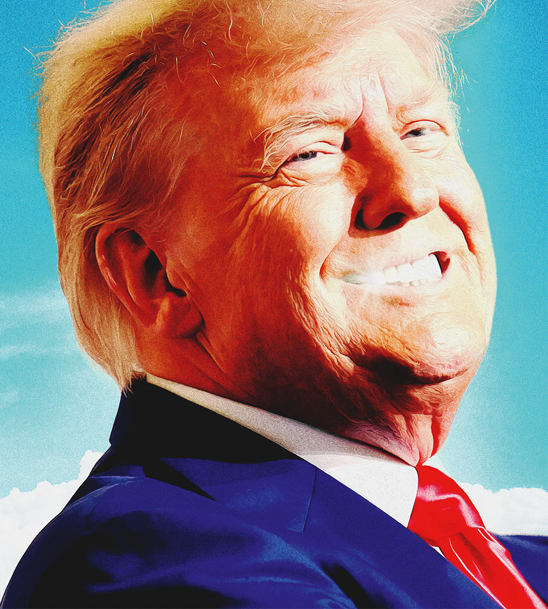

###### Our election endorsement

# A second Trump term comes with unacceptable risks 

##### If The Economist had a vote, we would cast it for Kamala Harris 

 

> Oct 31st 2024 

NEXT WEEK tens of millions of Americans will vote for Donald Trump. Some will do so out of grievance, because they think Kamala Harris is a radical Marxist who will destroy their country. Some are fired up by national pride, because Mr Trump inspires in them the belief that, with him in the White House, America will stand tall. Yet some will coolly opt to vote Trump as a calculated risk.

