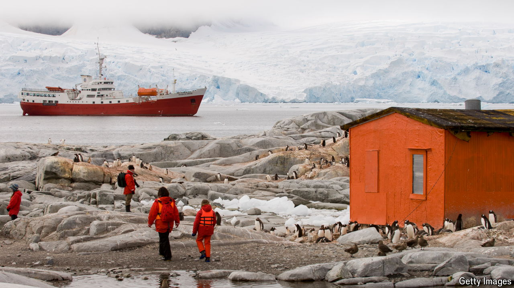

###### A very cold war

# How to avoid anarchy in Antarctica 

##### All that stands between the status quo and chaos is a fragile treaty 

 

> Oct 31st 2024 

ANTARCTICA IS THE only continent unbloodied by war. For over six decades peace on the frozen land mass has been kept by the Antarctic Treaty, an agreement signed in 1959 at the height of the cold war that established it as a demilitarised scientific preserve. But much like its ice sheet, the system governing Antarctica is in trouble as global warming opens up the possibility of mining virgin resources.

