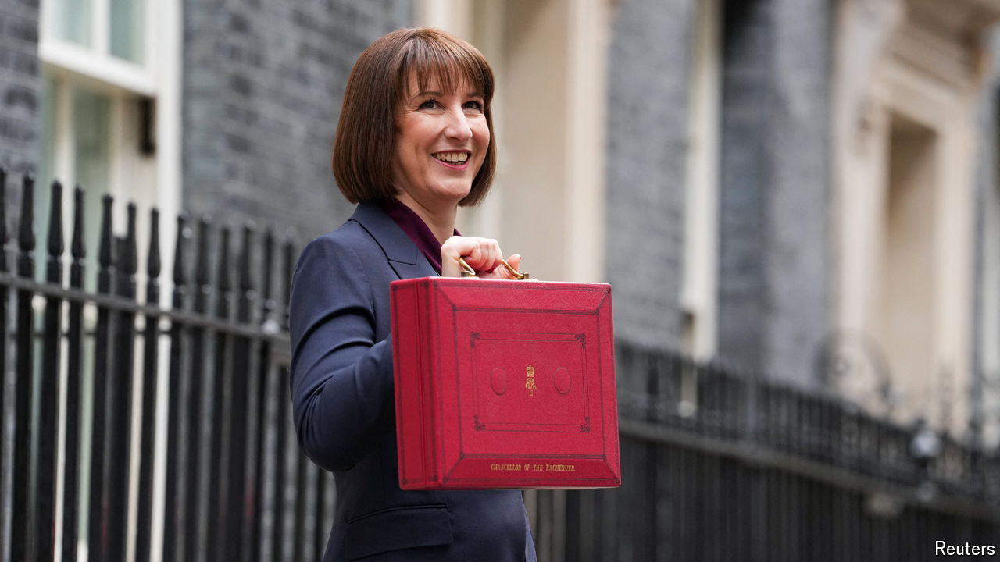

###### Mission unaccomplished

# The British budget combines large numbers and a narrow vision 

##### A bigger state but an irrational way to fund it 

 

> Oct 30th 2024 

Rachel Reeves, Britain’s , will never have a better moment to make bold changes than  she presented on October 30th. She had a mandate to fix public services, a huge parliamentary majority and four months to work out how to raise taxes and encourage growth. In the end, she offered an odd mix of eye-popping numbers and small-bore thinking. She has taken steps to fix Britain’s crumbling public services, chronic underinvestment and fairy-tale fiscal forecasts. But she has lost her best chance at reform. 

