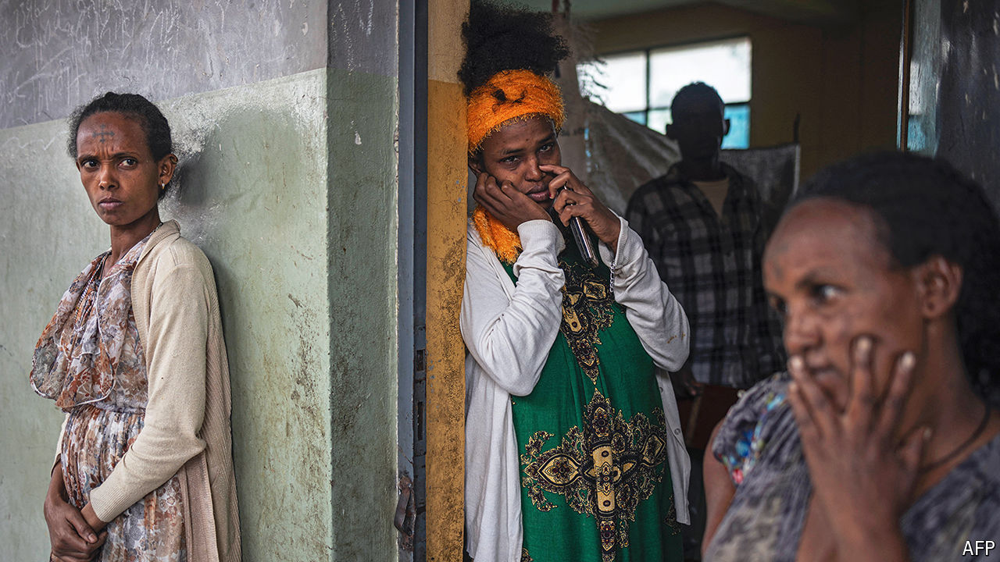

###### The not-quite-peace deal

# Another African war looms 

##### An agreement two years ago halted a bloody conflict in Ethiopia but sowed the seeds of new ones 

 

> Oct 27th 2024 

THE SOLDIER squints through his binoculars. “They can see us,” he warns, pointing to a silhouette of two figures on a hill in the distance. The men in his line of sight are soldiers from Eritrea. But the hill is in Tigray, a semi-autonomous region in northern Ethiopia. Eritrean troops control a significant chunk of Ethiopian territory on the border, in places reaching as far as 10km inside it. At night they creep even farther south, spying on military positions and kidnapping civilians. “Let them not start a war and we shall not go to war,” says Tsadkan Gebretensae, the interim vice-president of Tigray and a veteran military commander. “But we are very much aware that things could get out of control.”

