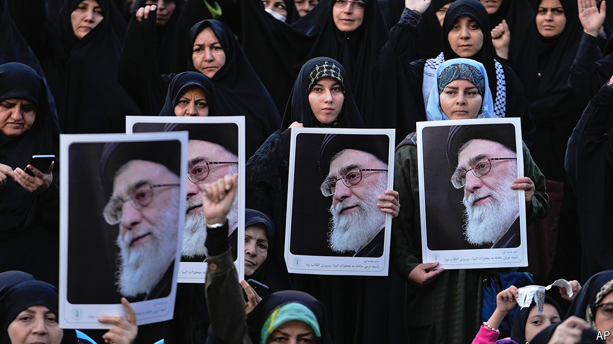

###### The aftermath of the Israeli strikes

# Iran needs a new national-security strategy 

##### Will it choose a nuclear bomb or detente with America? 

 

> Oct 28th 2024 

IT WAS TYPICAL Ali Khamenei: the man who makes the final decisions in Iran did not want to make one. On October 27th the supreme leader gave a speech about  on Iranian military facilities the previous day. It was a weighty moment: never before had the Jewish state overtly bombed the Islamic Republic, despite their decades-long shadow conflict. Yet Mr Khamenei’s words were muted. The Israelis, he vowed, would be made to understand the power of Iran. What that meant was up to others to decide: “Our officials should be the ones to assess and precisely apprehend what needs to be done,” he said. It was not a call for calm, but nor was it a declaration of war.

