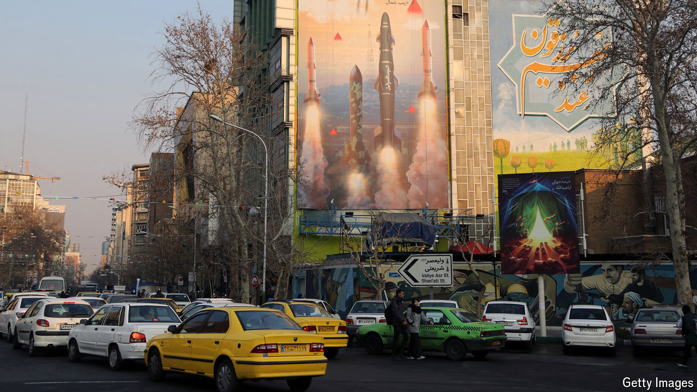

###### Diminished defences

# Israel is keeping open the nuclear option 

##### It has prepared a path to hit Iran’s nuclear sites after America’s election 

 

> Oct 31st 2024 

WHEN IRAN fired 181 ballistic missiles at Israel on October 1st, Binyamin Netanyahu, Israel’s prime minister, and at least some of his generals, spied an opportunity to do what the country’s air force had practised for decades—bomb Iran’s nuclear sites. The armada of more than 100 Israeli planes that flew east on October 26th instead hit only military facilities. But in doing so they may have disarmed Iran and paved the way for deeper and more ambitious attacks in the future. 

