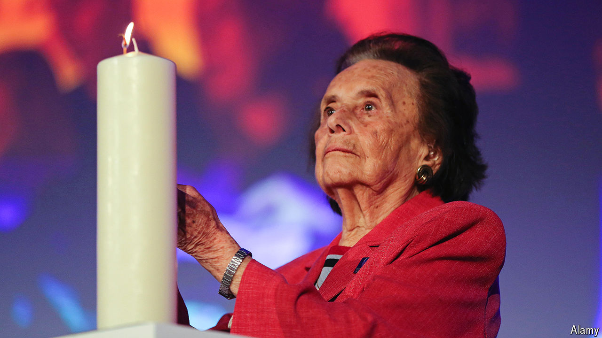

###### The necklace in the bread

# Lily Ebert lived to share her story of Auschwitz 

##### The Holocaust survivor and memoirist died on October 9th, aged 100 

 

> Oct 30th 2024 

FOR YEARS, Lily Ebert struggled to make good on the promise she had made to herself on Yom Kippur in 1944. She was then in Auschwitz; she, her mother, three sisters and a brother, like hundreds of thousands of other Hungarian Jews, had been sent there earlier that year. She promised herself that if she survived, she would tell the world what had happened there. She wanted to make sure no one else ever suffered what she was suffering. It was a lofty, perhaps unattainable goal. But she was 20, and more optimistic than many in her grim situation.

