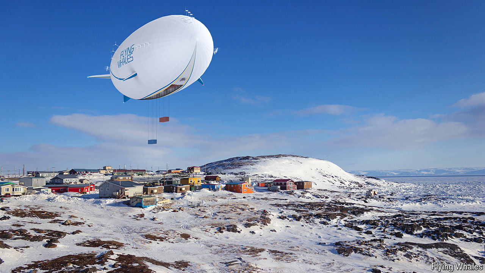

###### Blue-sky thinking

# Airships may finally prove useful for transporting cargo 

##### The problem of variable buoyancy is being overcome 

 

> Oct 30th 2024 

IN 1783 THE Montgolfier brothers lofted a trio of farm animals over Versailles in a hot-air balloon, in what remains the most iconic demonstration of the power of lighter-than-air craft. Since then such vehicles have adapted to carry ever more—and ever more distinguished—passengers. But they have rarely been used to transport cargo.

