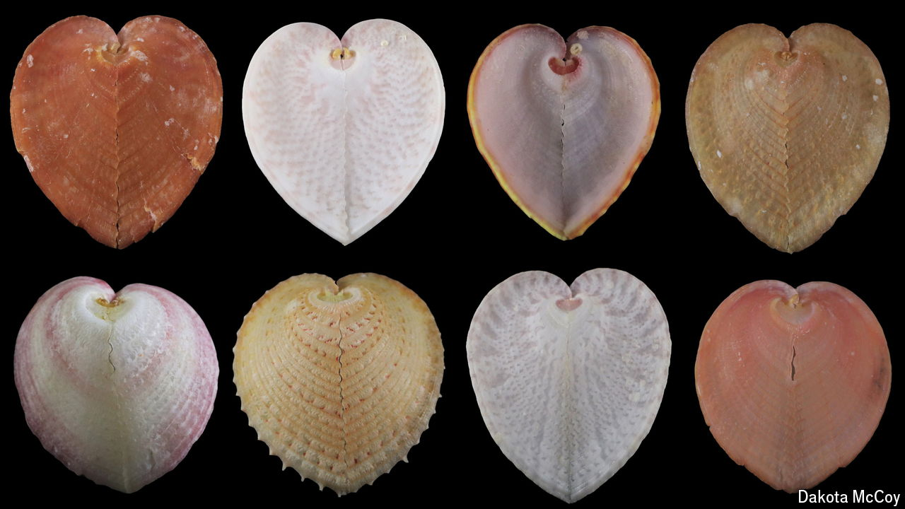

###### Bivalve broadband

# Heart-cockle shells may work like fibre-optic cables 

##### Inbuilt lenses transmit sunlight to symbiotic algae 

 

> Oct 28th 2024 

SLURPING OYSTERS from their shells may be a rare indulgence for humans, but these bivalve molluscs and their relatives, such as  and mussels, slurp for a living. Most are filter feeders, ingesting microscopic organisms as well as debris from their aquatic environments. A handful of mollusc species, however, have formed symbiotic partnerships with algae that live within their tissues. These individuals augment their diet with sugars that their microscopic partners produce through .

