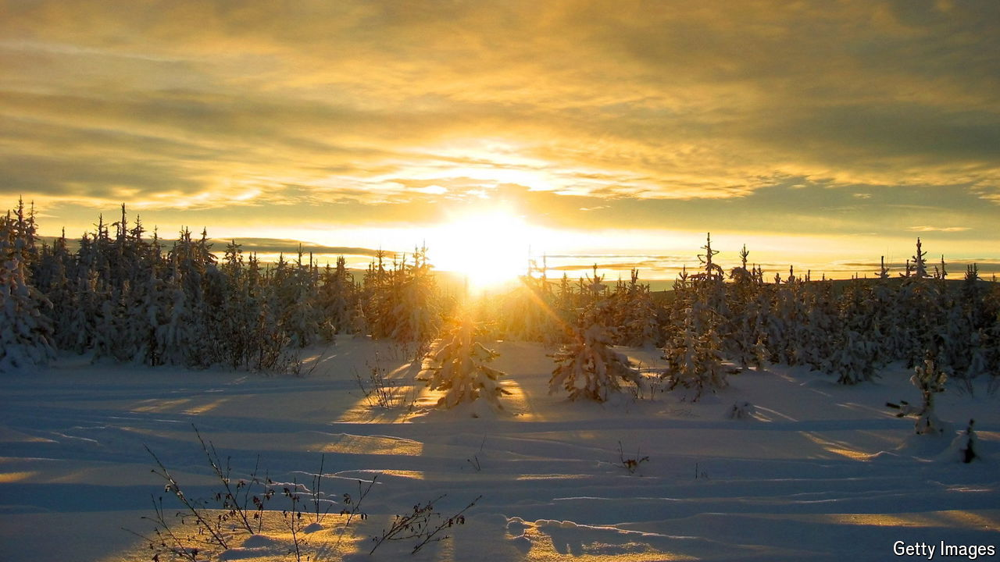

###### Climate justice

# Justin Trudeau is paying for solar panels in the cold, dark Arctic 

##### They can save diesel, but at a cost 

 

> Oct 31st 2024 

The Sayisi Dene First Nation seems like a bad spot for a solar farm. It gets about half as many hours of sunshine as a place like Arizona. Any solar panels installed there will produce less than half as much electricity. And yet the Canadian government has committed C$300m ($215m) to pointing panels at grey, sub-Arctic skies, not just in Manitoba, but across the country’s dark north. 

