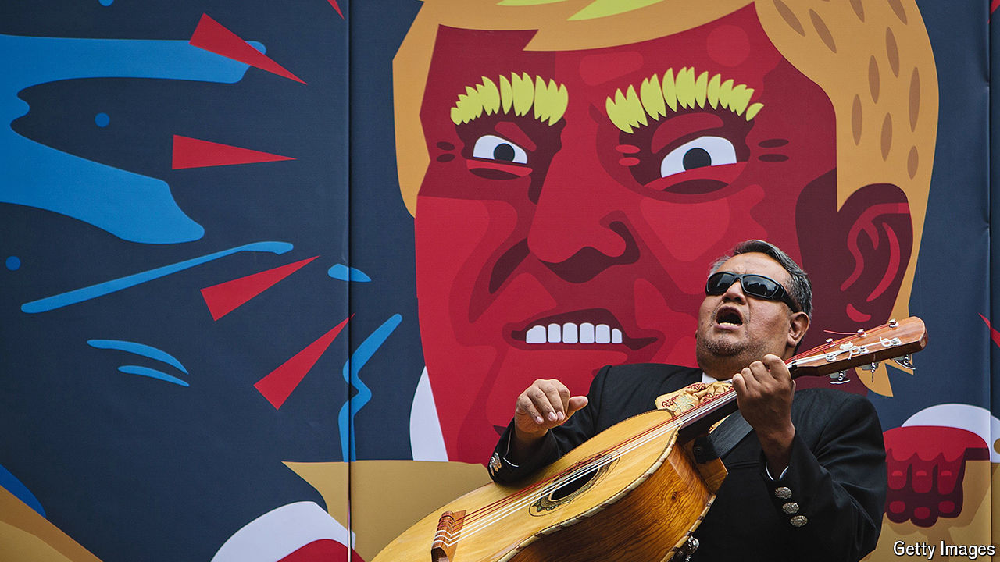

###### US elections and Mexico

# Triple trouble awaits Mexico if Donald Trump wins 

##### He detests its trade surplus, drug gangs and migrant flows 

 

> Oct 30th 2024 

Donald Trump’s time as president of the United States was difficult for Mexico. He threatened tariffs to force it to keep migrants on its side of the border while their asylum claims in the United States were processed, a policy known as Remain in Mexico. He tore up the North American Free Trade Agreement (NAFTA), which was crucial to Mexican prosperity.

