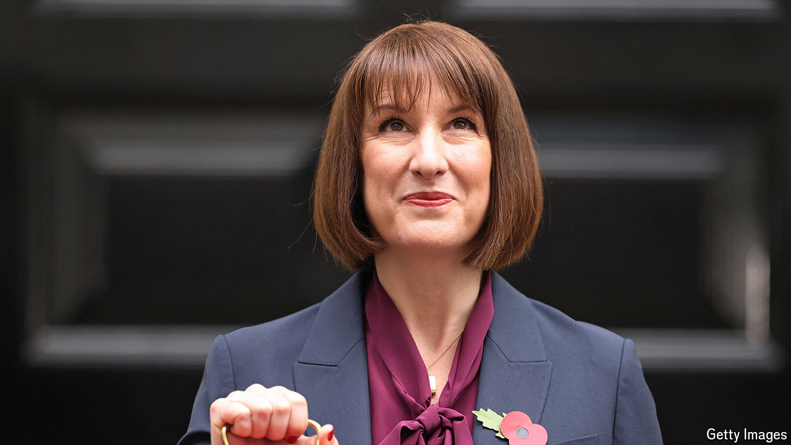

###### The world this week

# Politics 

#####  

 

> Oct 31st 2024 

Rachel Reeves,  chancellor of the exchequer, presented an . Taxes will rise by £40bn ($52bn; the biggest revenue raiser was an increase in employers’ national-insurance contributions. Ms Reeves changed her fiscal rules to enable lots more borrowing for capital investment and unveiled more spending on education, housing and green energy. The biggest winner was health care, which enjoyed the largest real-terms increase in spending since 2010, outside the pandemic.

