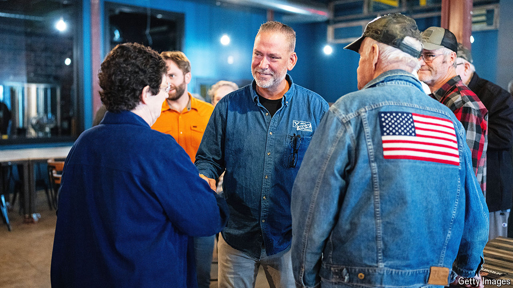

###### Osborn again


# Could a mechanic in Nebraska determine control of the Senate? 


##### Dan Osborn is challenging Republicans for the state’s working-class vote 

 


> Oct 30th 2024 


AT MOST POLITICAL events in America, the arrival of the candidate is a big deal. A crowd builds, underlings prepare, and eventually the chosen one sweeps in, the centre of attention. That was not what happened when Dan Osborn, an independent candidate  in Nebraska, arrived at his event in Omaha on October 22nd to discuss Social Security. Instead, he arrived early, then milled around at the back, looking like another member of the crowd. Yet Mr Osborn has ambitions to achieve one of the biggest upsets of this election: unseating a Republican incumbent, , in what ought to be one of the safest seats in America.

