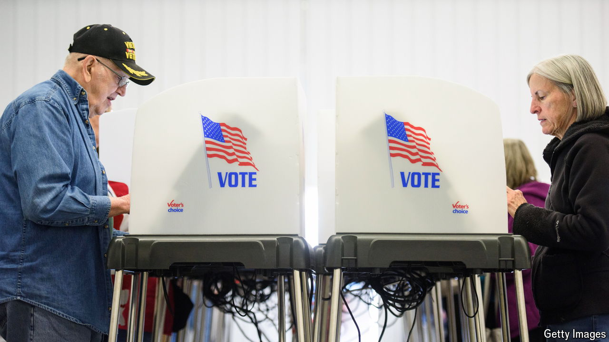

###### Campaign calculus: miss calculation

# How wrong could America’s pollsters be? 

##### Gamblers are a lot more confident that Donald Trump will win 

 

> Oct 29th 2024 

DESPITE POLLS being in essence tied, gamblers betting on the outcome of America’s presidential election are increasingly confident that Donald Trump, the Republican nominee, will win. Polymarket, a prediction market that has seen over $2.6bn traded on the election, gives him a two-in-three chance. Gamblers are in effect betting that polls are underestimating him for the third time in a row. 

