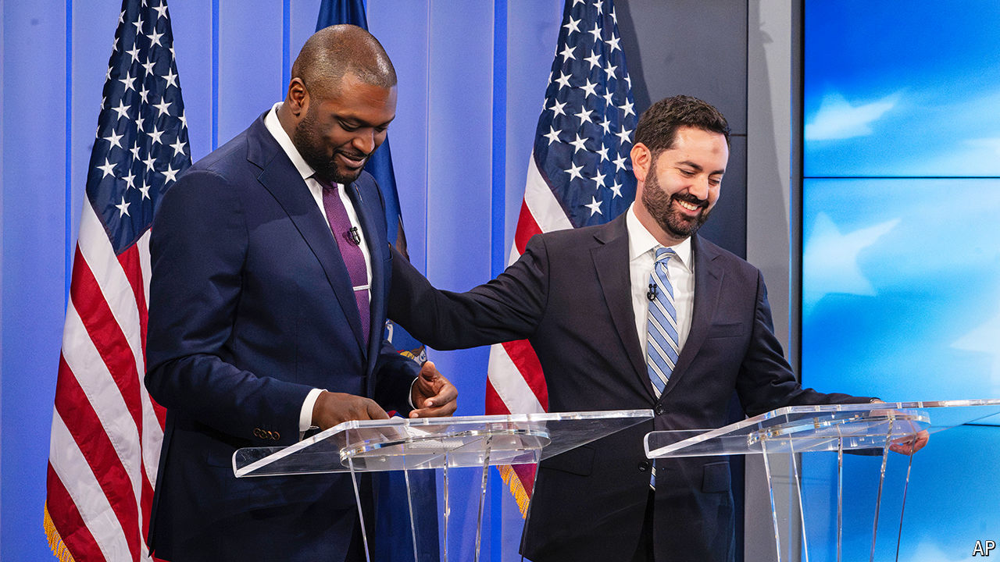

###### Bringing down the House

# The fight to win the most unruly institution in Washington 

##### Swing voters in House districts do not look like swing voters in the presidential election 

 

> Oct 31st 2024 

MIKE LAWLER, a Republican congressman representing New York’s 17th congressional district, considers himself a moderate. Mondaire Jones, a former congressman challenging Mr Lawler, also considers himself a moderate. Neither candidate in this swing race agrees with the other’s self-description. “At the end of the day, if it talks like a socialist, votes like a socialist—folks, it’s socialist,” Mr Lawler said in a recent debate. Mr Jones hit back, “If it talks like a fascist and supports a fascist for president of the United States for the third consecutive presidential election, then it’s a mini-fascist.” 

