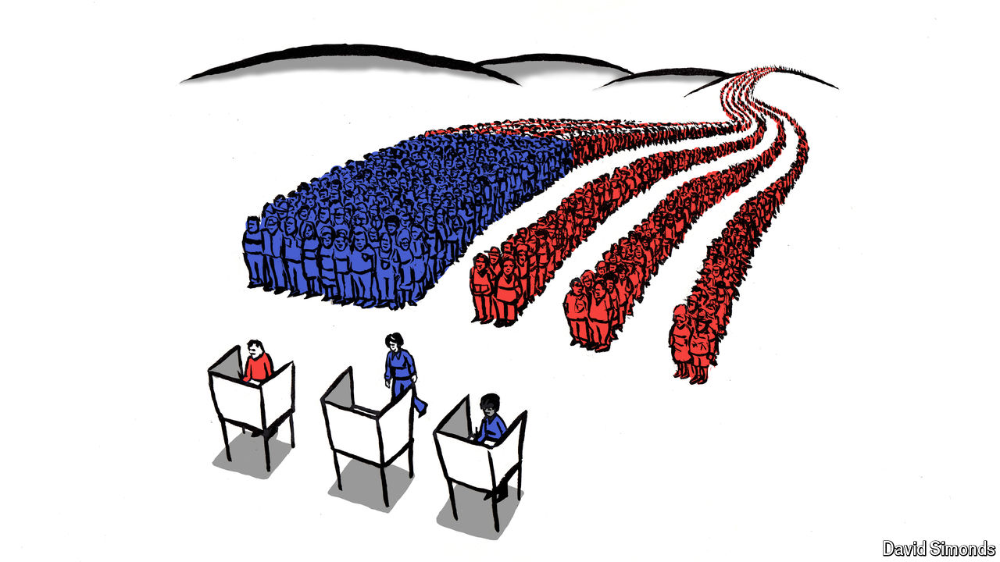

###### Lexington

# This campaign is also demonstrating America’s democratic vitality 

##### Let’s hope it’s not, in retrospect, the high point 

 

> Oct 31st 2024 

Masih Alinejad, an Iranian-American journalist and human-rights activist, likes to tell a story about walking through New York after appearing on various cable-TV networks to crusade against Iran’s oppression of women. Ms Alinejad, who has a nimbus of spiralling curls that makes her easy to recognise, describes being stopped by people who wanted to voice their support. But on one block a person pleaded with her not to appear again on Fox News (“They are miserable”) while on the next a person urged her to stop going on CNN (“They are using you”). 

