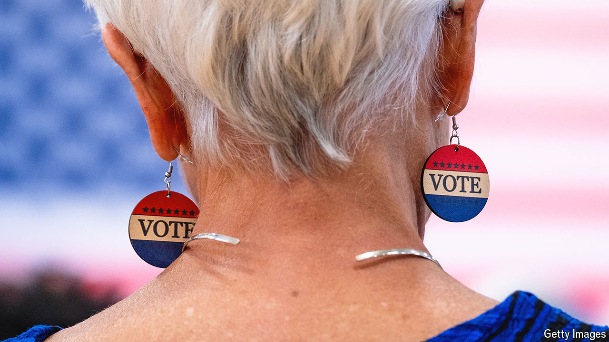

###### Take this into a count

# What to watch for on election night, and beyond 

##### The first clues on election night that could point to the next president 

 

> Oct 31st 2024 

THE result of the 2020 presidential election was the slowest to be called since 2000. Covid-19 restrictions, a mass switch to early voting, high turnout and tight margins in swing states led to four anxious days of vote-counting, nail-biting and Twitter-refreshing before Joe Biden was declared president-elect.

