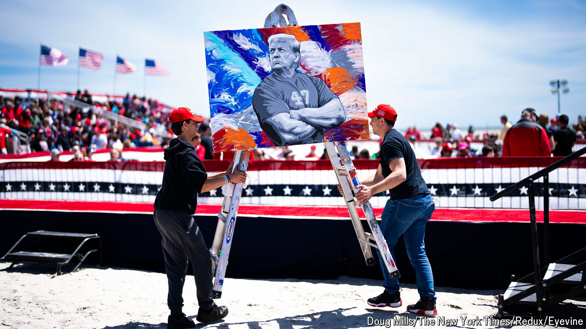

###### Young men on couches

# Will Donald Trump’s bros turn out? 

##### A strategy of courting occasional voters is risky because they are occasional voters 

 

> Oct 30th 2024 

Home to a university, Madison is a left-leaning city in a swing state. But if you happened to find yourself at the Kollege Klub on a recent Saturday night, where Sean Paul’s “Get Busy” instructed patrons to shake that thing, you would not know it. A man lobbed MAGA hats into a crowd of rapt frat bros. Presiding were the Nelk Boys, a group of supremely popular YouTubers who film inane pranks. They are fans of Donald Trump and have had him on their podcast three times. This was a party to gin up the vote. Yet voting felt like a concept of a plan compared with downing vodka Red Bulls and shimmying to Swedish House Mafia. 

