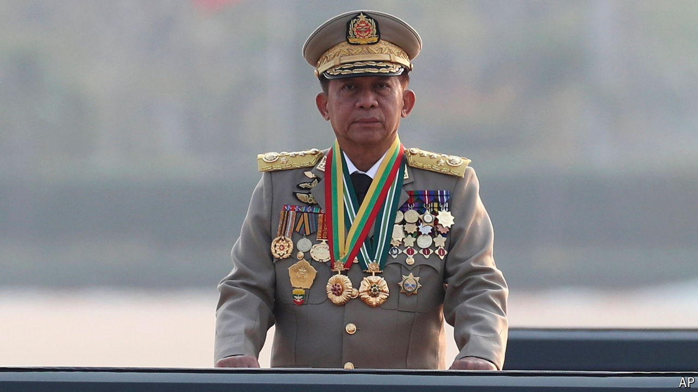

###### Pariah politics

# Myanmar’s junta chief finally goes to China 

##### It is the first visit since he staged a coup four years ago 

 

> Nov 7th 2024 

Few national leaders are as unwelcome abroad as Senior General Min Aung Hlaing, the leader of the military junta which seized power in Myanmar in 2021. Even North Korea’s Kim Jong Un gets the occasional invitation to Beijing. Min Aung Hlaing, by contrast, has received the cold shoulder from his northern neighbour. But on November 5th the general began his first visit to China since staging a coup nearly four years ago. 

