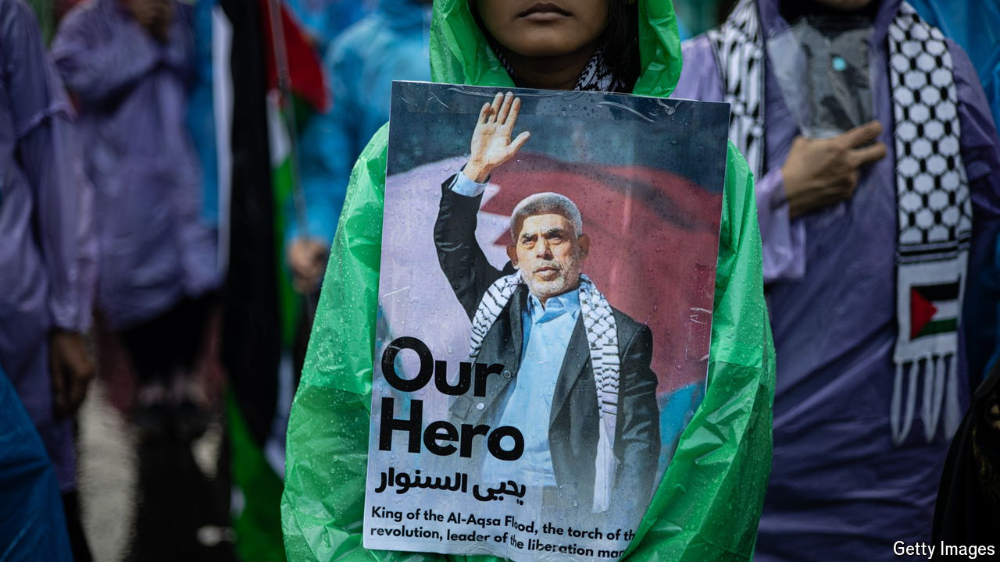

###### A burning issue

# South-East Asian Muslims are incensed by the war in Gaza 

##### A few may become radicalised off the back of it 

 

> Nov 7th 2024 

“I am not trying to be boastful...but I’ve taken measures and gone way beyond what other countries are willing to do,” Anwar Ibrahim, the prime minister of Malaysia, said to opposition members in parliament this week. He was arguing—and, indeed, boasting—that his government has outdone itself with its measures to punish Israel for the war in Gaza. This includes a ban on Israeli ships from docking at Malaysian ports and a halt to direct trade with the country. In response to Israel’s recent clampdown on the United Nations Relief and Works Agency for Palestinians, Mr Anwar announced plans for a draft resolution demanding the expulsion of Israel from the UN should it be found to be in violation of international law (which would be the first ousting of a member).

