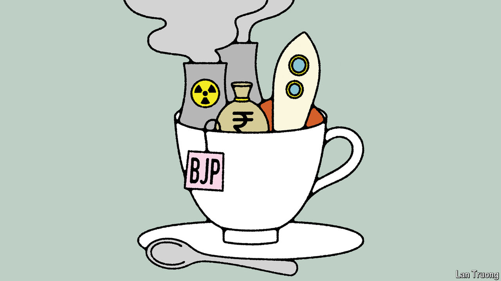

###### Banyan

# What Narendra Modi’s third term may look like 

##### Reading the tea leaves of parliaments past 

 

> Nov 7th 2024 

“IS MODI STILL THE PM?” read a text received by Banyan one recent afternoon. “I’m getting Modi withdrawal,” admitted the sender. It is usually difficult to notice the absence of something. But not Narendra Modi, who has dominated India’s newspapers, screens and imagination for the past decade. His Bharatiya Janata Party (BJP) has built an impressive personality cult around its leader, ensuring Indians never forget their prime minister. 

