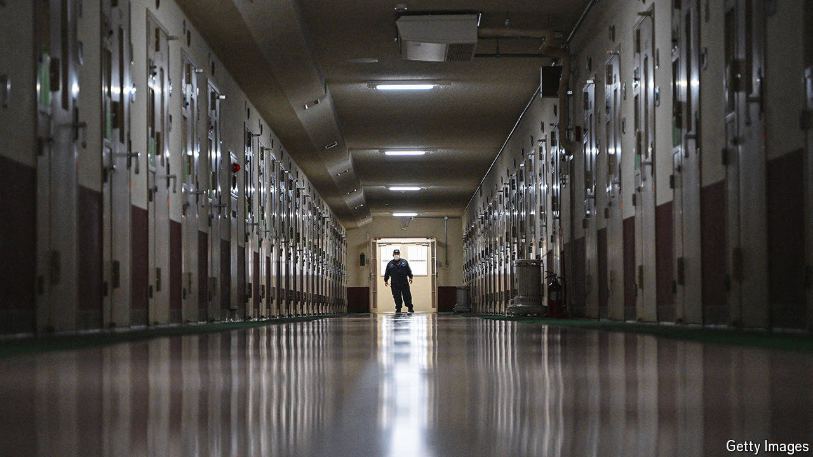

###### Crime and punishment

# Why suspects in Japan are almost never acquitted 

##### And it is facing renewed criticism 

 

> Nov 7th 2024 

In 2020 the president of Ohkawara Kakohki, a small machinery-making firm in Yokohama, near Tokyo, was arrested along with two of its executives. The charge? That the company was sending equipment to be turned into biological weapons in China. The three were detained for 11 months. Their application for bail was rejected by judges five times. The investigators implied they would be freed if they admitted the crime, but they refused. By the time they were released on bail one of them had died from stomach cancer without access to treatment. They were all eventually found to be innocent.

