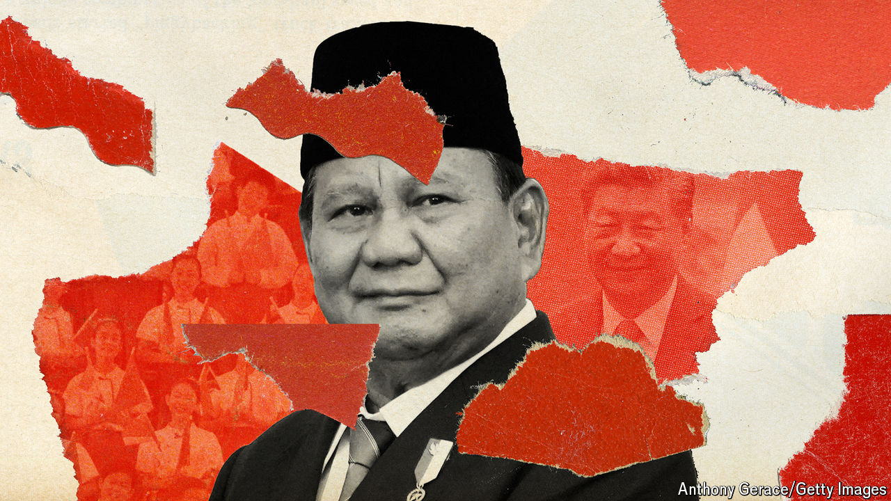

###### Indonesia’s foreign policy

# Will Prabowo Subianto cosy up to Donald Trump or to China? 

##### The first foreign trips for Indonesia’s new president’s raise awkward questions 

 

> Nov 7th 2024 

In September 1985 analysts from the CIA puzzled over who might succeed Suharto, Indonesia’s dictator and a stalwart opponent of communism. If the old man stayed in power into the 1990s, they reckoned, then his son-in-law, Army Captain Prabowo Subianto, might be a plausible heir. American officials had already begun cultivating Mr Prabowo, inviting him to America to attend . A Prabowo presidency, they reckoned, would .

