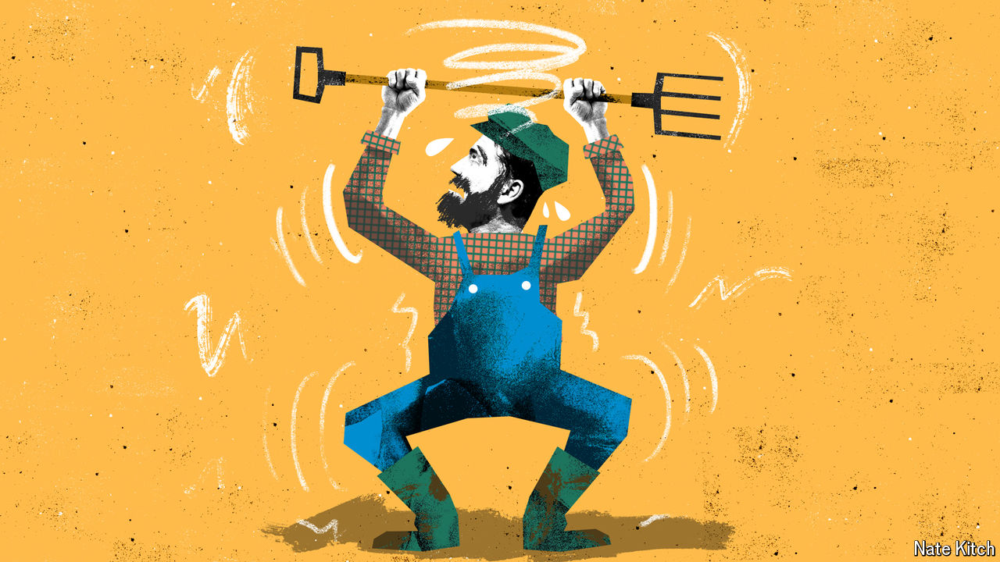

###### Bagehot

# Farmer fight: Jeremy Clarkson versus Roald Dahl 

##### Why are British farmers so politically feeble? 

 

> Nov 6th 2024 

“Never pick a fight with a profession that appears in a children’s book” has become a near-universal political rule of thumb since the advice first appeared in  two decades ago. Fishermen must be pampered; doctors and nurses placated; photo opportunities are sought with people who have  jobs, rather than sending emails. But what happens if that profession is the villain?

