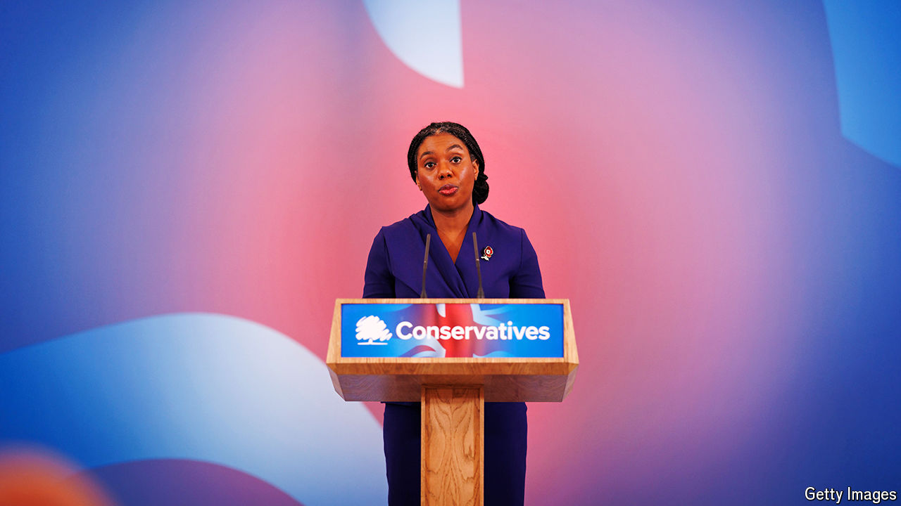

###### The Conservatives

# Kemi Badenoch, the Tories’ new leader, plans war on the “blob” 

##### It is not an obvious route to winning back disgruntled voters 

 

> Nov 2nd 2024 

The sign that Kemi Badenoch, who on November 2nd was elected leader of , was operating on a different plane from her rivals came at the party’s conference in October. While they busied themselves with cheesy selfies and cheesier merchandise, her team released a 22,000-word pamphlet, entitled “Conservatism in Crisis: Rise of the Bureaucratic Class”. It contained a sprawling theory, which combined Ms Badenoch’s pet issue of combating progressive identity politics with an idea circulating on the Tory right: that the “blob”, a sticky nexus of liberal interest groups, works to thwart the policy of Conservative governments. 


This “new bureaucratic class”, as Ms Badenoch terms it, comprises private-sector compliance lawyers, human-resources staff, university administrators, NGO workers and green lobbyists. They owe their comfortable middle-class livelihoods to demanding ever more government regulation to enforce, at the expense of the “old middle class” of entrepreneurs. And that regulation is to blame for an astonishing range of Britain’s ailments: , high taxation, high immigration, social polarisation, low-value degrees, a creaking health service and the weakening of the nation-state itself. The new bureaucratic class is, the authors wrote, a “new left, not based primarily on nationalisation and private sector trade unions, but ever increasing social and economic control”. It fell to the Tories to confront them.

